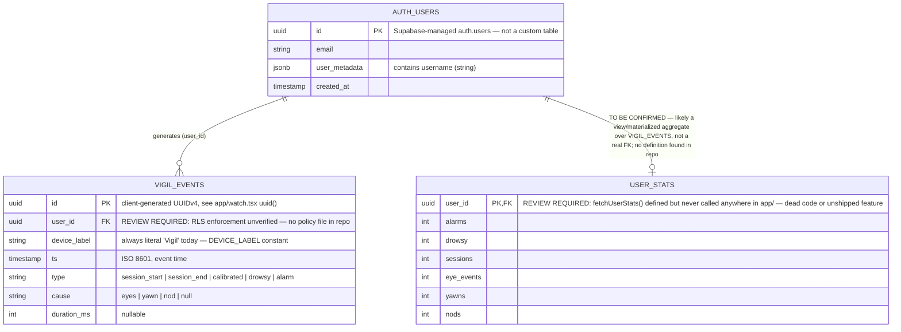
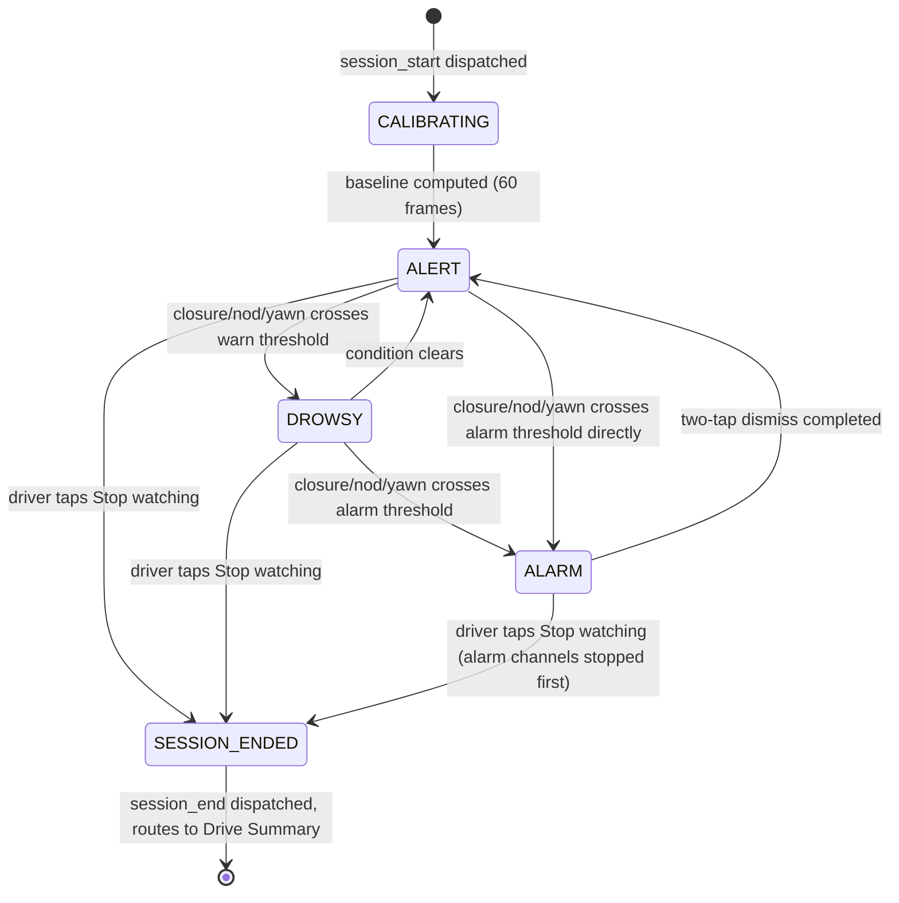
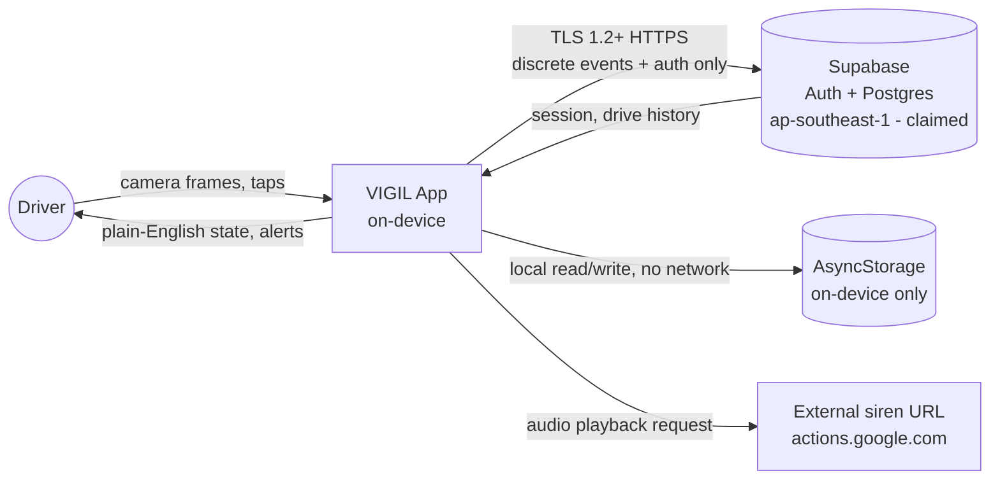
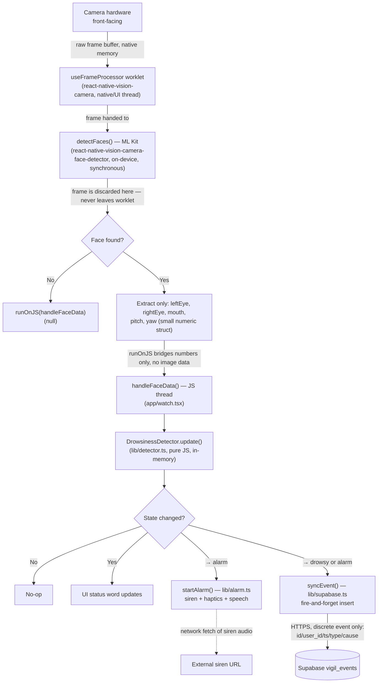
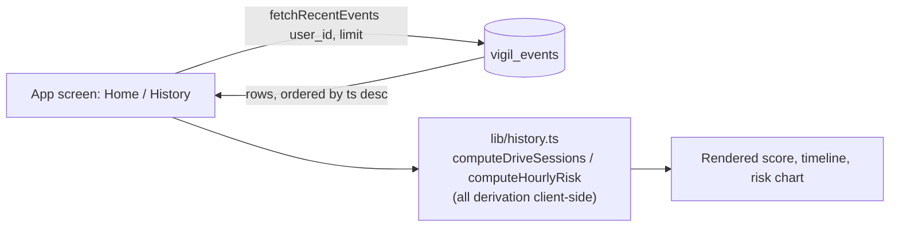
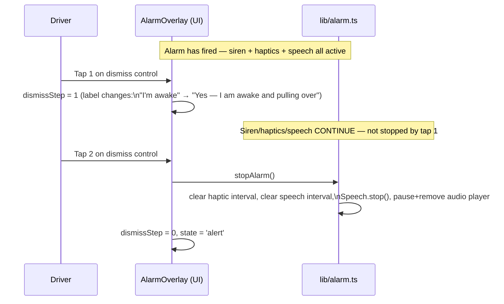
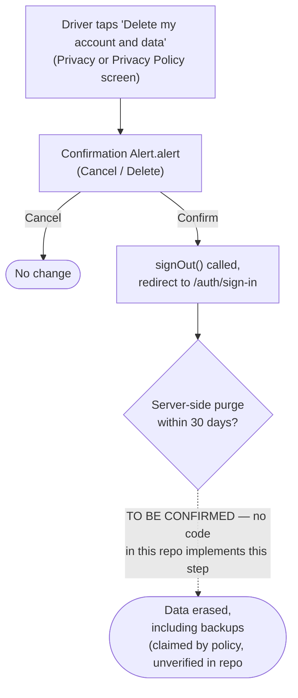

# VIGIL — Enterprise Technical Specification

```
Project: VIGIL (drowsiness-detection app for drivers)
Version: 1.0 — Initial generation
Date: 2026-09-18
Generated by: tech-spec-writer subagent, via the functional-spec-generator skill
Status: Draft — grounded in the codebase at commit 140cdeb ("Add user story and PRD
        documentation for VIGIL app features")
```

This is a **single whole-system technical specification** covering VIGIL's data
model, business logic, application structure, data flow, and security posture as a
whole — not a per-feature document. It complements (and cross-references, rather
than duplicates) `docs/prd/play-store-redesign.md` and
`docs/user-stories/play-store-redesign-flow.md`, which describe one initiative
(the Play Store redesign) from the product side.

**How to read this document — CURRENT vs PROPOSED.** VIGIL's codebase today already
ships most of what the Play Store redesign PRD describes as new work: plain-English
status words, a preset system that hides raw detector thresholds, a screen-off
"Pocket Mode," onboarding disclosure, and full privacy/PDPA screens are all already
implemented, not proposed. Wherever this spec draws on the PRD/user-stories content,
each item is explicitly tagged **[SHIPPED]** (exists in the code read for this spec),
**[PARTIAL]** (one of several competing designs is shipped; others are not), or
**[PROPOSED]** (described in the PRD/user-stories only, no corresponding code found).
See Section 3 (Business Rules) and Section 4 (Stages & Results) for the full
breakdown.

---

## Document Index

1. [Entity Relationship Diagram](#1-entity-relationship-diagram)
2. [Data Fields Reference](#2-data-fields-reference)
3. [Business Rules](#3-business-rules)
4. [Stages & Results](#4-stages--results)
5. [Form Validation Rules](#5-form-validation-rules)
6. [Application Structure](#6-application-structure)
7. [Data Flow](#7-data-flow)
8. [Process Flow Diagram](#8-process-flow-diagram)
9. [Security Improvement Plan](#9-security-improvement-plan)
10. [Readme](#10-readme)

---

## 1. Entity Relationship Diagram

**[TO BE CONFIRMED]** — No `supabase/` or migrations directory exists anywhere in
this repository. Every entity and column below is reverse-engineered from the actual
Supabase client calls in `lib/supabase.ts`, `app/watch.tsx`, `app/index.tsx`,
`app/history.tsx`, and `app/privacy.tsx`. There is no schema file, SQL migration, or
Supabase project export to cite. The live Supabase project's true column types,
constraints, indexes, and RLS policies should be confirmed against the actual
project (`mcp__claude_ai_Supabase__list_tables` / `list_migrations` was not available
in this environment) before this ERD is treated as authoritative.



**Notes on what is NOT a stored entity:**
- **No `sessions`/`drives` table exists.** A "drive session" is not a row anywhere.
  `lib/history.ts` `computeDriveSessions()` reconstructs sessions **client-side, at
  read time**, by pairing `session_start`/`session_end` events chronologically and
  counting `drowsy`/`alarm` events that fall between them. This is a derived view
  over `VIGIL_EVENTS`, not a persisted entity — deliberately omitted from the ERD
  above for that reason.
- **No `profiles` table exists.** The display name (`username`) lives in Supabase
  Auth's own `user_metadata` JSON, set via `supabase.auth.updateUser({ data:
  { username } })` in `lib/auth.tsx`, not a custom row.
- **Settings and onboarding state are not in Supabase at all.** `VigilSettings`
  (preset, screen-off toggle, alert-channel toggles) and the onboarding-complete
  flag are `AsyncStorage`-only (`lib/settings.tsx`, keys `vigil.settings.v1` and
  `vigil.onboarding-complete.v1`) — local to the device, never synced.

---

## 2. Data Fields Reference

### 2.1 `vigil_events` [TO BE CONFIRMED against live Supabase project — no migration file exists]

| Field | Type (inferred) | Required | Default | Constraints | Description |
|---|---|---|---|---|---|
| id | uuid / string | Yes | none — client-supplied | PK, unique | Generated client-side via a `Math.random()`-based UUIDv4-shaped string helper (`uuid()` in `app/watch.tsx`) — **not** `crypto.randomUUID()`; **[REVIEW REQUIRED]**: `Math.random()` is not cryptographically strong, and the client (not the server) mints the primary key, which combined with unverified RLS (see Section 9) means row-ID collision/spoofing risk is unquantified. |
| user_id | uuid / string | Yes | none | FK → `auth.users.id` (intended) | Passed from `useAuth()`'s `user.id`. **[TO BE CONFIRMED]** whether an RLS policy restricts `insert`/`select` to `auth.uid() = user_id` — no policy definition found in-repo. |
| device_label | string | Yes | `'Vigil'` (hardcoded) | none observed | Field exists to support multiple devices per account but is never set to anything but the literal constant `DEVICE_LABEL` today — effectively inert. |
| ts | timestamptz (ISO string) | Yes | client `Date.now()` at call time | none observed | Event timestamp, always client-clock-derived — **[REVIEW REQUIRED]**: no server-side timestamp validation found; a client with a wrong device clock would silently skew history/summary data. |
| type | string (enum-like) | Yes | none | Application-level union only: `'session_start' \| 'session_end' \| 'calibrated' \| 'drowsy' \| 'alarm'` — **not enforced by a DB check constraint that this codebase can confirm** | `'calibrated'` is declared in the `VigilEvent` TypeScript interface but is **never actually dispatched** anywhere in `app/watch.tsx` — only `session_start`, `session_end`, `drowsy`, `alarm` are sent. **[REVIEW REQUIRED]**: likely dead/future code. |
| cause | string \| null | No | `null` | Application-level union only: `'eyes' \| 'yawn' \| 'nod' \| null` | Populated from `DetectorUpdate.cause` (`lib/detector.ts`) on `drowsy`/`alarm` events; `null`/absent for `session_start`/`session_end`. |
| duration_ms | int \| null | No | `null` | none observed | Only populated where callers pass it; in the current code, `dispatch()` in `app/watch.tsx` never actually passes a `durationMs` argument when calling `syncEvent`, so this column is **effectively always null in practice today** — **[REVIEW REQUIRED]**. |

### 2.2 `user_stats` [TO BE CONFIRMED — no schema definition found; possibly a Postgres view]

| Field | Type (inferred) | Required | Default | Constraints | Description |
|---|---|---|---|---|---|
| user_id | uuid | Yes | — | PK/FK (assumed) | Queried via `.eq('user_id', userId).single()` in `fetchUserStats()`. |
| alarms | int | — | — | — | Cumulative alarm count (assumed aggregate over `vigil_events` where `type='alarm'`). |
| drowsy | int | — | — | — | Cumulative drowsy-event count. |
| sessions | int | — | — | — | Cumulative session count. |
| eye_events | int | — | — | — | **[TO BE CONFIRMED]** — no corresponding `type` value in `vigil_events` maps cleanly to "eye_events" as a distinct category; likely an aggregate of `cause='eyes'` rows. |
| yawns | int | — | — | — | Likely aggregate of `cause='yawn'` rows. |
| nods | int | — | — | — | Likely aggregate of `cause='nod'` rows. |

**[REVIEW REQUIRED]**: `fetchUserStats()` is fully implemented in `lib/supabase.ts`
but is not imported or called anywhere under `app/` in this codebase snapshot. Either
this is dead code from a prior UI iteration (plausible, since the PRD says the old
UI "exposes raw ML detector internals/event counters" which this shape matches), or
it is scaffolding for a feature not yet wired up. Confirm intent before removing or
before building against it.

### 2.3 `auth.users` (Supabase-managed)

| Field | Type | Required | Default | Constraints | Description |
|---|---|---|---|---|---|
| id | uuid | Yes | Supabase-generated | PK | Standard Supabase Auth user id. |
| email | string | Yes (password auth) | — | unique, Supabase-enforced | Used for sign-in and displayed in Settings/Privacy screens. |
| user_metadata.username | string | No | unset | none | Set at sign-up (`signUpWithPassword`) and editable via `updateUsername()`; displayed on the home screen, falls back to the email's local-part if unset. |

### 2.4 Local-only settings (`AsyncStorage`, never synced to Supabase)

| Key | Shape | Default | Description |
|---|---|---|---|
| `vigil.settings.v1` | `VigilSettings` JSON: `{ preset: 'relaxed'\|'standard'\|'strict', screenOffEnabled: bool, spokenWarning: bool, siren: bool, vibration: bool }` | `{ preset:'standard', screenOffEnabled:true, spokenWarning:true, siren:true, vibration:true }` | Merged over defaults on load; corrupt JSON is caught and defaults are kept (`lib/settings.tsx`). |
| `vigil.onboarding-complete.v1` | `'1'` string flag | absent (treated as not-complete) | Gates the onboarding → home redirect in `app/index.tsx`. |

---

## 3. Business Rules

Rules are numbered `BR-xxx`. Each is tagged **[SHIPPED]** (verified in code read for
this spec), **[PARTIAL]** (one of several competing options shipped), or
**[PROPOSED]** (documented in the PRD/user-stories only; no supporting code found).

| Rule ID | Category | Description | Trigger | Expected Outcome | Status |
|---|---|---|---|---|---|
| BR-001 | Detection | Eyes are classified "closed" when the average of left/right eye-open probability drops below `eyeClosedThreshold` (default 0.4). | Every processed camera frame with a detected face | `closureMs` accumulates from the moment closure starts | [SHIPPED] `lib/detector.ts` |
| BR-002 | Detection | A `drowsy` state fires when eye closure has persisted ≥ `warnSeconds` (default 1.0s), OR head-nod duration ≥ half of `nodSeconds`, OR yawn count in the last 60s ≥ `yawnsPerMinuteAlarm - 1`. | Detector `update()` call | UI transitions to `drowsy`; if the transition is `alert → drowsy`, a `drowsy` event is dispatched to Supabase | [SHIPPED] `lib/detector.ts`, `app/watch.tsx` |
| BR-003 | Detection | An `alarm` state fires when eye closure ≥ `alarmSeconds` (default 1.8s), OR head-nod duration ≥ `nodSeconds` (default 1.2s), OR yawn count in the last 60s ≥ `yawnsPerMinuteAlarm` (default 3). | Detector `update()` call | Full-screen alarm overlay takes over; `startAlarm()` fires siren + haptics + speech; an `alarm` event is dispatched | [SHIPPED] |
| BR-004 | Detection | A calibration phase runs for the first `calibrationFrames` (default 60) frames of every watching session, computing the median head-pitch as the per-session baseline before any drowsy/alarm classification can occur. | Session start / detector `reset()` | State displays as `calibrating` ("CHECKING") until baseline is set | [SHIPPED] |
| BR-005 | Sensitivity presets | Three named presets — Relaxed, Standard, Strict — remap detector thresholds without ever exposing a numeric value to the driver. Relaxed: `warnSeconds 1.6 / alarmSeconds 2.6 / nodPitchDelta 14 / nodSeconds 1.6 / yawnsPerMinuteAlarm 4`. Strict: `warnSeconds 0.6 / alarmSeconds 1.2 / nodPitchDelta 8 / nodSeconds 0.8 / yawnsPerMinuteAlarm 2`. Standard: detector defaults. | Preset selection on Home or Settings | The next watching session (via `configForPreset()`) uses the new thresholds; no app restart required | [SHIPPED] `lib/settings.tsx` — this is the exact mechanism the PRD's FR-08/FR-25 describe as needed; it already exists |
| BR-006 | Alertness scoring | A completed drive's alertness score is the share of the drive's timeline that stayed alert: alarm/drowsy markers are bucketed into 9 time slots (worst state per slot) and the score is `round(alertSlots / 9 × 100)`. | Drive ends (`stopWatching`) | Score displayed on Drive Summary and History screens, consistent with the "when it happened" timeline chart | [SHIPPED] `lib/history.ts` `bucketizeOffsets()`, `alertPercent()` |
| BR-007 | Risk pattern | Each hourly bucket (0–23, local time) of the "risky hours" chart accumulates weight `+2` per `alarm` event and `+1` per `drowsy` event whose timestamp falls in that hour. | History screen render | Bar chart of 12 two-hour buckets (24 hourly buckets aggregated by 2) rendered from the driver's own event history only | [SHIPPED] `lib/history.ts` `computeHourlyRisk()` |
| BR-008 | Session reconstruction | A "drive" is derived, not stored: a `session_start` opens a session; the next `session_end` closes it; any `drowsy`/`alarm` events in between are tallied into that session. An unterminated session (missing `session_end`) is auto-closed at the next `session_start`. | Any read of drive history (Home "last drive", History list) | Sessions list, most recent first, capped to the requested limit | [SHIPPED] `lib/history.ts` `computeDriveSessions()` |
| BR-009 | Raw detector internals hidden from UI | No screen renders EAR/MAR-equivalent numeric probabilities, raw thresholds, or per-frame counters — only status words (`READY`/`ALERT`/`DROWSY`/`CHECKING`/`WAKE UP`) and plain sentences. | Any monitoring/status screen render | Driver sees plain language only | [SHIPPED] — contrary to the PRD's framing ("today's UI exposes raw ML detector internals"), the codebase read for this spec already hides these; that framing appears to describe an older prior version not present here |
| BR-010 | Alarm dismissal | Silencing an active alarm requires exactly two sequential taps: the first tap changes the dismiss control's label/state only; only the second tap stops siren, haptics, and speech. | Alarm active, driver taps dismiss control | First tap: state changes, alarm continues. Second tap: `stopAlarm()` called, all channels stop | [SHIPPED] `app/watch.tsx` `tapDismiss()` |
| BR-011 | Alert-channel combination | Spoken warning, siren, and vibration are independently toggleable in Settings and all three fire together by default when enabled. | Alarm trigger | `startAlarm()` reads `settings.siren/vibration/spokenWarning` and starts each enabled channel | [SHIPPED] `lib/alarm.ts` |
| BR-011a | Prevent all-channels-disabled | The system should prevent, or explicitly warn against, a state where siren, vibration, and spoken warning are all disabled simultaneously (a silent alarm is a safety failure). | Driver toggles the last remaining enabled channel off | Warning shown / state prevented | [PROPOSED] — PRD FR-26; **no such guard exists in `app/settings.tsx`** today — a driver can currently disable all three toggles with no warning. **[REVIEW REQUIRED]** — safety-relevant gap. |
| BR-012 | Screen-off watching | Detection and alarm triggering continue while the screen-off "Pocket Mode" overlay is shown, whether collapsed (near-black, pulsing "WATCHING" dot) or expanded (tap-to-reveal status, auto-collapses after 8s). | "Turn the screen off" tapped | `frameProcessor` keeps running (component stays mounted); Pocket Mode is a UI overlay, not a stop of detection | [PARTIAL / SHIPPED as an in-app overlay] — matches PRD Story 4.1 (pocket mode) exactly. Stories 4.2 (notification-as-interface) and 4.3 (dimmed dash face) are **[PROPOSED]** only — not implemented. |
| BR-013 | True screen-off / locked-device operation | Camera + detection should keep running via an Android foreground service even if the OS screen is fully off/locked (not just an in-app dimmed view while the app stays foregrounded). | N/A | A persistent foreground-service notification with PAUSE/STOP actions | [PROPOSED] — `app.json` declares `FOREGROUND_SERVICE`/`FOREGROUND_SERVICE_MEDIA_PLAYBACK` Android permissions, but **no foreground-service implementation, notification channel, or native module wiring was found** in the code read for this spec. Today's "screen off" is an in-app dark overlay (`PocketMode` component) — the phone's actual display and app must remain in the foreground the whole time. **[REVIEW REQUIRED]** — this is the single largest gap between the declared permission set and the implemented behavior. |
| BR-014 | Do Not Disturb override | The alarm should override DND/silent mode so it is audible even if the device is muted. | Alarm trigger while device is in DND/silent mode | Audio/vibration still play | [PROPOSED] — PRD FR-20 / DEP-04; **no DND-override permission request or handling code was found**. `lib/alarm.ts` calls standard `expo-audio`/`expo-haptics`/`expo-speech` APIs with no DND-bypass logic. **[REVIEW REQUIRED]** — safety-relevant gap: an alarm may currently be silenced by the OS if the device is muted. |
| BR-015 | Account/data deletion execution | Deletion requests must be fully executed (including backups) within 30 days of confirmation, per the stated PDPA commitment. | "Delete my account and data" confirmed | Server-side purge job runs within the retention window | [PROPOSED — UI only] — `app/privacy.tsx`'s `deleteAccount()` and `app/privacy-policy.tsx`'s `withdrawConsent()` currently only call `signOut()` and redirect; the code comments explicitly note "Actual row purge happens server-side... this client only has an anon key, so it can request, not execute, deletion." **No server-side function, Supabase Edge Function, or scheduled job implementing the purge was found in this repository.** **[REVIEW REQUIRED]** — the app makes a binding 30-day PDPA promise in its UI copy that no code in this repo can be confirmed to fulfill. |
| BR-016 | Camera frames never persisted | Raw camera image data must never leave the phone or be written to storage. | Every camera frame | Frame is processed in the `useFrameProcessor` worklet and discarded; only derived numeric face-geometry values cross the JS bridge | [SHIPPED] — see Section 7 (Data Flow) for the exact code path; this is the real technical basis for the privacy policy's "camera images never leave the phone" claim, not just UI copy |
| BR-017 | Auth error handling | Sign-in/sign-up failures should be surfaced with a specific, inline error distinguishing credentials vs. network failures. | Failed `signInWithPassword`/`signUp` call | Distinct error messaging | [PARTIAL] — an error **is** surfaced (`Alert.alert('Sign In Failed', error)` / `Alert.alert('Sign Up Failed', error)` in `app/auth/sign-in.tsx`), using Supabase's own `error.message` verbatim. It is **not** classified into "credentials vs. network" categories as PRD FR-06 specifies — both cases render through the same generic path. **[REVIEW REQUIRED]** — partial gap vs. FR-06. |

---

## 4. Stages & Results

VIGIL's primary lifecycle entity is a **watching session** (a "drive"), which — per
BR-008 — is not a stored row but a derived reconstruction over `vigil_events`. The
stage model below documents the *session's* runtime lifecycle as implemented in
`app/watch.tsx` and `lib/detector.ts`; all transitions are system-triggered from
camera/frame data, with two driver-triggered exceptions (start, stop, and alarm
dismiss).

| Stage code | Name | Entry condition | Exit condition | Triggered by | Valid result states |
|---|---|---|---|---|---|
| `CALIBRATING` | Checking | Session starts (`DrowsinessDetector.reset()`) | `calibrationFrames` (60) frames processed and pitch baseline computed | System (frame processor) | → `ALERT` |
| `ALERT` | Alert | Baseline set; no closure/nod/yawn condition met | Any BR-002/BR-003 condition met | System | → `DROWSY`, → `ALARM` |
| `DROWSY` | Drowsy | BR-002 condition met from `ALERT` | Condition clears (→ `ALERT`) or worsens (→ `ALARM`) | System | → `ALERT`, → `ALARM` |
| `ALARM` | Alarm (full-screen override) | BR-003 condition met from any state | Two-tap dismiss completed (BR-010) | System (entry) / Driver (exit, two taps) | → `ALERT` |
| `SESSION_ENDED` | Drive complete | Driver taps "Stop watching" (any screen state) | Terminal — routes to Drive Summary | Driver | Persisted as `session_end` event; summary computed from in-memory markers, not re-queried |



**Display-mode overlay (orthogonal to detection stage):** independent of the
`CALIBRATING`/`ALERT`/`DROWSY`/`ALARM` state machine above, the screen can be in
**screen-on** (full preview + status) or **Pocket Mode** (screen-off overlay,
collapsed/expanded) display mode — this is a UI concern only and does not gate or
alter the detection state machine (BR-012). An active `ALARM` always takes over the
full screen regardless of which display mode was active beforehand.

**Account/data-deletion lifecycle [PROPOSED, UI-only today — see BR-015]:**

| Stage | Entry | Exit | Notes |
|---|---|---|---|
| `ACTIVE` | Default | Driver confirms "Delete my account and data" / "Withdraw consent and delete everything" | |
| `DELETION_REQUESTED` | Deletion confirmed in-app | [TO BE CONFIRMED] — no server-side state machine found | Per PRD, should complete within 30 days including backups; **no code in this repo implements or tracks this stage server-side** |
| `DELETED` | Server-side purge completes | Terminal | [TO BE CONFIRMED] — unverifiable from this codebase |

---

## 5. Form Validation Rules

### Form: Sign In / Create Account (`app/auth/sign-in.tsx`)

| Field | Rule (as implemented) | Error Message | Trigger |
|---|---|---|---|
| E-mail | Non-empty (`!email` check) | *(none — submit silently no-ops)* | On submit tap |
| Password | Non-empty (`!password` check) | *(none — submit silently no-ops)* | On submit tap |
| Name (create-account mode only) | Non-empty (`!name` check) | `Alert.alert('Name required')` | On submit tap, create-account mode only |
| E-mail/Password combined | Delegated entirely to Supabase (`signInWithPassword`/`signUp`) | `Alert.alert('Sign In Failed', error.message)` or `Alert.alert('Sign Up Failed', error.message)` — Supabase's raw message, not a custom mapping | On failed Supabase call |
| Google OAuth | N/A (delegated to provider) | `Alert.alert('Google Sign In Failed', error.message)` | On failed `signInWithOAuth` call |

**[REVIEW REQUIRED]** gaps vs. the PRD (FR-06):
- No email-format validation (e.g. regex/`keyboardType="email-address"` is set but
  not enforced) exists client-side before submit.
- No password strength/format rule exists — any non-empty string is submitted.
- No visible field-level inline error UI — all errors surface as a blocking native
  `Alert`, not inline near the field.
- Credentials-vs-network error distinction (explicitly required by PRD FR-06) is
  **not implemented** — both paths render through the same generic alert using
  Supabase's raw `error.message`.
- Submitting with empty email/password silently does nothing (`if (!email ||
  !password) return;`) rather than showing any error to the driver — **[REVIEW
  REQUIRED]**: a driver tapping submit on an empty form gets no feedback at all.

### Form: Camera Permission Disclosure (`components/PermissionDisclosure.tsx`)

Not a data-entry form — a consent gate. Two actions only: "ALLOW CAMERA" (proceeds
to `Camera.requestCameraPermission()`) and "Not now" (dismisses, no OS prompt
triggered — matches PRD FR-04 exactly). No validation rules apply.

### Form: Settings (`app/settings.tsx`)

| Field | Rule (as implemented) | Error Message | Trigger |
|---|---|---|---|
| Sensitivity preset | One of `relaxed`/`standard`/`strict`, enforced by the `PresetSegmented` control's fixed option set | N/A — no invalid state reachable via UI | On selection |
| Spoken warning / Siren / Vibration toggles | Independent booleans, no cross-field validation | **None** — see BR-011a | On toggle |
| Screen-off toggle | Boolean | N/A | On toggle |

**[REVIEW REQUIRED]**: per BR-011a, there is no validation preventing all three
alert-channel toggles from being disabled simultaneously, despite the PRD (FR-26)
calling this out as a required guard against a "silent alarm" safety failure.

### Form: Privacy — Delete Account confirmation (`app/privacy.tsx`, `app/privacy-policy.tsx`)

| Field | Rule | Error Message | Trigger |
|---|---|---|---|
| Deletion confirmation | Native `Alert.alert` two-button confirm (Cancel / Delete or Withdraw & delete) — no typed confirmation (e.g. "type DELETE") required | N/A | On tap "Delete my account and data" / "Withdraw consent and delete everything" |

No async/duplicate-check validation exists anywhere in the app (no username
uniqueness check, no duplicate-email pre-check — both delegated entirely to
Supabase's own constraint errors surfaced via the generic error alert above).

---

## 6. Application Structure

### 6.1 Architecture style

Client-only mobile application (no custom backend service code in this repository) —
**Expo Router file-based navigation** over **React Native**, backed by
**Supabase** (managed Postgres + Auth) as a Backend-as-a-Service. All business logic
(detection, scoring, session reconstruction) runs **on-device**; the "backend" is
limited to auth and an append-only event log. There is no custom server, API layer,
or edge function present in this repository — **[TO BE CONFIRMED]** whether any
Supabase Edge Functions exist in the live project (e.g. for account deletion, per
BR-015) that simply aren't checked into this repo.

### 6.2 Technology stack (from `package.json` — exact versions, not estimated)

| Layer | Technology | Version |
|---|---|---|
| Framework | Expo | ~57.0.23 |
| Navigation | expo-router | ~57.0.21 |
| UI runtime | React | 19.2.3 |
| UI runtime | React Native | 0.86.3 |
| Camera | react-native-vision-camera | ^4.7.3 |
| Face detection | react-native-vision-camera-face-detector (ML Kit) | ^1.10.2 |
| Frame-processor runtime | react-native-worklets | 0.10.1 |
| Frame-processor runtime | react-native-worklets-core | ^1.6.3 |
| Animation | react-native-reanimated | 4.5.1 |
| Gestures | react-native-gesture-handler | ~2.32.0 |
| Vector graphics | react-native-svg | 15.15.4 |
| Backend client | @supabase/supabase-js | ^2.105.4 |
| Local persistence | @react-native-async-storage/async-storage | 2.2.0 |
| Audio (alarm siren) | expo-audio | ~57.0.5 |
| Haptics (alarm vibration) | expo-haptics | ~57.0.3 |
| TTS (alarm spoken warning) | expo-speech | ~57.0.3 |
| Keep-awake | expo-keep-awake | ~57.0.2 |
| Fonts | @expo-google-fonts/barlow, barlow-condensed | ^0.4.1 |
| Language | TypeScript | ~6.0.3 |
| Build tooling | babel-preset-expo | ~57.0.0 |
| Native config | expo-build-properties (Android minSdkVersion 26) | ~57.0.20 |

### 6.3 Module / folder breakdown

```
vigil-drowsiness-native/
├── app/                          Expo Router file-based routes (screens)
│   ├── _layout.tsx                Root Stack, AuthProvider > SettingsProvider, font load, splash gate
│   ├── onboarding.tsx             First-run value prop + camera disclosure → sign-in
│   ├── index.tsx                  Home / pre-drive readiness ("/")
│   ├── watch.tsx                  Active monitoring: camera, detector loop, Pocket Mode, alarm overlay
│   ├── drive-summary.tsx          Post-drive score + timeline (route-param driven, no DB read)
│   ├── history.tsx                Drive list + weekly risk chart (DB read)
│   ├── settings.tsx               Preset + alert-channel toggles, sign-out
│   ├── privacy.tsx                Data-safety summary, download/delete data
│   ├── privacy-policy.tsx         Full PDPA policy text, DPO contact, retention table
│   └── auth/
│       └── sign-in.tsx            Combined sign-in / create-account screen
├── components/
│   ├── ui.tsx                     Shared primitives: Btn, Blueprint, Toggle, PresetSegmented, PRESET_COPY
│   └── PermissionDisclosure.tsx   Play-Store-required pre-permission disclosure modal
├── lib/
│   ├── detector.ts                DrowsinessDetector — pure TS state machine (no RN deps)
│   ├── settings.tsx               VigilSettings context, AsyncStorage persistence, preset→config mapping
│   ├── alarm.ts                   startAlarm()/stopAlarm() — siren (remote URL), haptics, speech
│   ├── auth.tsx                   AuthProvider/useAuth — thin wrapper over supabase.auth
│   ├── supabase.ts                Supabase client init, syncEvent/fetchRecentEvents/fetchUserStats
│   ├── history.ts                 Pure functions: session reconstruction, scoring, hourly risk, formatting
│   └── theme.ts                   Design tokens: colors, fonts, font asset map
├── app.json                        Expo config: bundle/package IDs, Android permissions, plugins
├── eas.json                        EAS Build configuration
└── package.json                    Dependency manifest (see 6.2)
```

### 6.4 Key components

- **`DrowsinessDetector` (`lib/detector.ts`)** — the entire detection algorithm,
  intentionally free of any React Native or Supabase dependency, making it
  independently unit-testable. Consumes per-frame `FaceData` (eye/mouth open
  probabilities, pitch/yaw angles from ML Kit) and returns a `DetectorUpdate`
  (state, cause, and raw numeric telemetry for internal use — **never rendered to
  the driver directly**, only consumed to derive the plain-English status word).
- **`WatchScreen` (`app/watch.tsx`)** — the most complex screen: owns the
  `useFrameProcessor` worklet, bridges face data to JS via `runOnJS`, drives the
  `DrowsinessDetector` instance (held in a `ref`, not state, to avoid re-renders per
  frame), and renders three mutually exclusive views (normal / `PocketMode` /
  `AlarmOverlay`) based on detector state and a local `screenOff` boolean.
- **`AuthProvider` (`lib/auth.tsx`)** — session state via
  `supabase.auth.getSession()` + `onAuthStateChange` subscription; all screens read
  `useAuth().user` to gate access (`Redirect` to `/auth/sign-in` if absent).
- **`SettingsProvider` (`lib/settings.tsx`)** — the single source of truth for
  preset + alert-channel + screen-off preferences, persisted to `AsyncStorage`;
  also owns the onboarding-complete flag.

### 6.5 External integrations

| Integration | Purpose | Notes |
|---|---|---|
| Supabase (Postgres + Auth) | Event log storage, authentication | Region claimed as Singapore (`ap-southeast-1`) per `app/privacy-policy.tsx` UI copy — **[TO BE CONFIRMED]** against the actual project settings, not verifiable from this repo |
| Google OAuth (via Supabase Auth) | Social sign-in | `supabase.auth.signInWithOAuth({ provider: 'google' })` |
| ML Kit (via react-native-vision-camera-face-detector) | On-device face/eye/mouth/head-pose detection | Runs entirely on-device; no network call |
| `https://actions.google.com/sounds/v1/alarms/beep_short.ogg` | Alarm siren audio source | **[REVIEW REQUIRED]** — fetched over the network at alarm time via `createAudioPlayer(url)`, not bundled as a local asset; see Section 9 |

### 6.6 Environment tiers

**[TO BE CONFIRMED]** — no `.env.example`, CI config, or EAS build-profile
environment matrix was found/inspected in this pass. `eas.json` exists in the repo
(per git status) but its build-profile contents (dev/preview/production channel
config, environment variable sets) were not read for this spec —
recommend confirming dev/staging/production Supabase project separation before
relying on this section. The app reads `EXPO_PUBLIC_SUPABASE_URL` and
`EXPO_PUBLIC_SUPABASE_ANON_KEY` from the environment at build/runtime
(`lib/supabase.ts`), implying at least one environment-variable-driven Supabase
project target exists.

---

## 7. Data Flow

### 7.1 Actors

- **Driver** — the sole human actor; originates camera frames (passively, by being
  in view), settings changes, and account actions.
- **VIGIL client app** — processes everything on-device.
- **Supabase (Auth + Postgres)** — the only external system that receives
  driver-originated data.
- **ML Kit (on-device, via react-native-vision-camera-face-detector)** — not a
  network actor; a native on-device library.

### 7.2 Data stores

- **Device: `AsyncStorage`** — settings, onboarding flag (never leaves device).
- **Device: camera frame buffer** — transient, in native memory, never persisted or
  exposed to JS as image data.
- **Device: in-memory detector state** — `DrowsinessDetector` instance fields
  (calibration samples, closure/yawn/nod timers) — lost on session end, never
  persisted as raw telemetry.
- **Supabase Postgres: `vigil_events`** — the only server-side data store, an
  append-only discrete-event log (see Section 2.1).
- **Supabase Auth: `auth.users`** — credentials, email, username metadata.

### 7.3 Level 0 (context) — data at rest vs. in transit



**Encryption notes:** the privacy policy screen (`app/privacy-policy.tsx`) states
TLS 1.2+ in transit and AES-256 at rest — this reflects Supabase's platform-level
defaults, not app-specific configuration; **[TO BE CONFIRMED]** against the actual
Supabase project's settings, since no code in this repo configures encryption
directly (encryption at rest is a Supabase/Postgres platform property, not something
the client controls).

### 7.4 Level 1 (system internals) — the drowsiness-detection pipeline

This is the data flow that grounds the privacy claim "camera images never leave the
phone" in actual code, not just policy text:



**Key property:** only two things ever cross from the native/worklet layer to JS —
(1) small numeric face-geometry values (never an image), and (2) discrete named
events (`drowsy`, `alarm`, `session_start`, `session_end`) with a timestamp and
cause category — never continuous telemetry, never raw EAR/MAR-equivalent scores,
never a frame or any image-derived blob. This is the concrete, verifiable basis for
BR-016 and for the privacy policy's collection claims.

### 7.5 Secondary flow — read path (history / last-drive)



No server-side aggregation, view materialization for session reconstruction, or
scheduled job was found — all history/summary computation happens client-side on
every render, over up to 500 raw event rows (`history.tsx` requests `limit=500`).
**[REVIEW REQUIRED]**: this scales linearly with event count client-side; no
pagination or server-side rollup exists yet.

---

## 8. Process Flow Diagram

### 8.1 Primary journey — onboarding through a completed drive

Matches the PRD's Section 10 nine-step flow; **the steps below are all [SHIPPED]**
in the codebase read for this spec, except where marked.

```mermaid
flowchart TD
  Start([App launch]) --> Onboarded{Onboarding\ncomplete?}
  Onboarded -- No --> Onboarding[Onboarding value-prop screen]
  Onboarding --> Disclosure["Camera disclosure modal\n(PermissionDisclosure)"]
  Disclosure -- "Not now" --> DisclosureDeadEnd["Dead-end: no OS prompt,\ndetection unavailable"]
  Disclosure -- "Allow camera" --> OSPrompt["OS camera-permission dialog"]
  OSPrompt --> SignIn["Sign in / Create account\n(Google OAuth or e-mail+password)"]
  Onboarded -- Yes --> AuthCheck{Signed in?}
  SignIn --> AuthCheck
  AuthCheck -- No --> SignIn
  AuthCheck -- Yes --> Home["Home / pre-drive readiness\npreset selector, screen-off toggle,\nlast-drive summary"]
  Home --> PermCheck{Camera permission\ngranted?}
  PermCheck -- No --> Disclosure
  PermCheck -- Yes --> StartWatching["START WATCHING tapped"]
  StartWatching --> Calibrating["CALIBRATING\n(60-frame baseline)"]
  Calibrating --> Monitoring{"Active monitoring\n(screen-on or Pocket Mode)"}
  Monitoring -- "threshold crossed" --> Alarm["ALARM overlay\n(full-screen, two-tap dismiss)"]
  Alarm -- "two taps completed" --> Monitoring
  Monitoring -- "Stop watching tapped" --> StopFlow["session_end dispatched"]
  Alarm -- "Stop watching tapped\n(after dismiss)" --> StopFlow
  StopFlow --> Summary["Drive Summary\nscore + timeline"]
  Summary -- DONE --> Home
  Summary -.->"optional"--> History["History\ndrive list + weekly risk chart"]
```

### 8.2 Alarm dismissal sequence (safety-critical path, BR-010)



### 8.3 Account deletion flow [PROPOSED beyond the UI layer — see BR-015]



---

## 9. Security Improvement Plan

### 9.1 Authentication & Authorisation

**Current state:** Supabase Auth (email/password + Google OAuth), session persisted
via `AsyncStorage` with `autoRefreshToken`/`persistSession` enabled and
`detectSessionInUrl: false` (correct for a mobile app, avoids URL-based session
hijack vectors relevant to web). No custom authorization layer exists client-side —
all access control is expected to be enforced by Supabase Row-Level Security (RLS).

**[TO BE CONFIRMED] — Finding S-01 (High):** No RLS policy definition exists
anywhere in this repository (no `supabase/migrations`, no policy SQL). The claim in
`app/privacy-policy.tsx` ("Row-level security: your records are readable only by
your own signed-in account") is UI copy only and cannot be verified against actual
policy configuration from this codebase. **Recommendation:** confirm and, ideally,
check the live RLS policies into version control (e.g. via `supabase db pull`) so
this claim is auditable and regression-tested going forward.

### 9.2 Data Protection (PII handling, encryption, masking)

**Current state:** Camera frames are provably never persisted or transmitted (see
Section 7.4 code path) — this is the strongest part of VIGIL's current security
posture. Account PII is limited to email + optional display name; drive data is
limited to discrete timestamped events, not continuous telemetry. `EXPO_PUBLIC_*`
env vars intentionally expose the Supabase URL and anon key client-side, which is
the expected pattern for an anon-key + RLS-protected Supabase app — **not a finding
on its own**, but its safety is entirely contingent on Finding S-01 above.

**Finding S-02 (High) — [REVIEW REQUIRED]:** No server-side mechanism for executing
account/data deletion was found in this repository (BR-015). The app makes a
binding, PDPA-framed promise ("erased within 30 days, including from backups") in
its UI copy with no verifiable implementation. **Recommendation:** implement and
document (e.g. a Supabase Edge Function + scheduled job, or a documented manual
runbook) the actual deletion-execution path before this claim ships to production,
or soften the in-app copy until it exists.

**Finding S-03 (Medium):** `id` (the `vigil_events` primary key) is generated
client-side using a `Math.random()`-based UUID-shaped string (`app/watch.tsx`
`uuid()`), not a cryptographically secure generator. **Recommendation:** switch to
`crypto.randomUUID()` (available in modern Hermes/RN) or let Postgres generate the
ID server-side (`gen_random_uuid()` as the column default) instead of trusting the
client.

### 9.3 Input Validation & Injection Prevention

**Current state:** All Supabase access goes through the `@supabase/supabase-js`
client, which parameterizes queries — no raw SQL string interpolation is present in
this codebase, so classic SQL injection risk is low by construction. No XSS surface
exists in the traditional sense (no WebView/HTML rendering of user content found).

**Finding S-04 (Medium) — [TO BE CONFIRMED]:** `syncEvent()` inserts `user_id`
supplied directly by the client (`useAuth().user.id`), with `type`/`cause` values
also client-supplied strings rather than validated against a strict enum at the
network boundary. Whether a malicious/modified client could insert events under an
arbitrary `user_id`, or with an out-of-range `type`/`cause` value, depends entirely
on RLS + check-constraint enforcement server-side (see S-01) — this cannot be ruled
out or confirmed from the client code alone. **Recommendation:** confirm (a) an RLS
`WITH CHECK (auth.uid() = user_id)` policy exists on `insert`, and (b) a `CHECK`
constraint restricts `type`/`cause` to the known enum values.

### 9.4 API Security (rate limiting, token expiry, CORS, HTTPS)

**Current state:** All Supabase traffic uses HTTPS by default (Supabase does not
offer plaintext HTTP). Token expiry/refresh is handled by `supabase-js`'s
`autoRefreshToken`. CORS is not directly relevant to a native mobile client.

**Finding S-05 (Medium):** No client-side or (verifiably) server-side rate limiting
was found on `syncEvent()` inserts. A compromised or modified client could insert an
unbounded number of event rows per session. **Recommendation:** confirm Supabase
project-level rate limiting / abuse protection is enabled, and consider a
server-side check limiting event-insert frequency per user.

### 9.5 Audit Logging

**Finding S-06 (Low) — [TO BE CONFIRMED]:** No application-level audit log (e.g. who
changed settings, who requested/executed a deletion) was found in this repository.
`vigil_events` functions as a domain event log (drives/alarms) but not a security
audit trail (auth events, admin actions, deletion requests). **Recommendation:**
if/when Finding S-02's deletion pipeline is built, ensure it writes an auditable
record of request → confirmation → execution timestamps, since this is also a PDPA
accountability obligation.

### 9.6 Known Risks — OWASP Mobile / Top 10 relevance checklist

| OWASP category | Relevance to VIGIL | Status |
|---|---|---|
| A01 Broken Access Control | RLS enforcement on `vigil_events` is unverifiable from this repo (S-01) | **[REVIEW REQUIRED]** |
| A02 Cryptographic Failures | Encryption in transit/at rest relies on Supabase platform defaults, not app config; not independently misconfigurable from client code found here | Low risk, [TO BE CONFIRMED] at platform level |
| A03 Injection | Parameterized Supabase client used throughout; no raw SQL found | Low risk |
| A04 Insecure Design | Alarm's safety-critical dependency on a live network fetch for siren audio (S-07 below) is a design-level safety gap, not just a bug | **[REVIEW REQUIRED]** |
| A05 Security Misconfiguration | `EXPO_PUBLIC_*` anon-key exposure is expected/by-design given RLS; contingent on S-01 | Contingent |
| A07 Identification & Auth Failures | Standard Supabase Auth flows; no MFA option found/implemented | [TO BE CONFIRMED] whether MFA is in scope |
| A08 Software & Data Integrity Failures | Client-generated primary keys (S-03); client-supplied `user_id`/`type`/`cause` on insert (S-04) | **[REVIEW REQUIRED]** |
| A09 Security Logging & Monitoring Failures | No audit trail beyond the domain event log (S-06) | Low-Medium |

**Finding S-07 (High, safety-critical) — [REVIEW REQUIRED]:** `lib/alarm.ts` fetches
the alarm siren audio from a **live external URL**
(`https://actions.google.com/sounds/v1/alarms/beep_short.ogg`) at the moment the
alarm fires, rather than bundling it as a local asset. If the device has no network
connectivity at that moment (a materially plausible scenario while driving), the
`try/catch` silently swallows the failure and **the siren channel simply does not
play** — haptics and speech still run, but the loudest, most attention-grabbing
channel of a safety-critical wake-up alarm can silently fail. **Recommendation:**
bundle the siren as a local audio asset (e.g. via `expo-asset`, already a
dependency) so alarm audio has zero network dependency.

**Finding S-08 (High, safety-critical) — [REVIEW REQUIRED]:** No Do Not Disturb /
silent-mode override was found in the code (BR-014). If the driver's phone is in DND
or silent mode, the current implementation gives no indication that the alarm would
still be audible — because it may not be. **Recommendation:** either implement the
DND-override permission flow the PRD calls for (FR-20), or clearly caveat in-app
that alarm audio may be suppressed by device silent/DND mode until that ships.

### 9.7 Improvement Backlog (prioritized)

| Priority | Item | Finding |
|---|---|---|
| High | Bundle alarm siren as a local asset — remove network dependency from the safety-critical alarm path | S-07 |
| High | Implement or document a real Do Not Disturb override for the alarm | S-08 / BR-014 |
| High | Confirm and version-control RLS policies on `vigil_events` / `user_stats` | S-01 |
| High | Implement the actual server-side account/data deletion pipeline within the claimed 30-day window, or soften the in-app PDPA claim until it exists | S-02 / BR-015 |
| Medium | Move `vigil_events.id` generation server-side (`gen_random_uuid()`) instead of client `Math.random()`-based UUIDs | S-03 |
| Medium | Add a `CHECK` constraint / server-side validation on `type`/`cause` enum values; confirm insert-time RLS ties `user_id` to `auth.uid()` | S-04 |
| Medium | Confirm/enable rate limiting on event inserts | S-05 |
| Medium | Add the "prevent all alert channels disabled" guard (BR-011a) in Settings | BR-011a |
| Medium | Add credentials-vs-network error distinction to sign-in/sign-up (PRD FR-06) | BR-017 |
| Low | Add an audit trail for deletion requests once S-02 is built | S-06 |
| Low | Resolve whether `fetchUserStats()`/`user_stats` is dead code or an unshipped feature | Section 2.2 |
| Low | Clarify `duration_ms` — currently never populated by any caller | Section 2.1 |

---

## 10. Readme

### Project name and purpose

**VIGIL** is a React Native (Expo) drowsiness-detection app for drivers. It uses the
front camera and on-device ML Kit face detection to watch for closing eyes, yawns,
and head-nodding, classifies driver alertness in real time via a pure-TypeScript
detector (`lib/detector.ts`), and sounds a multi-channel alarm (siren, spoken
warning, vibration) when a configurable drowsiness threshold is crossed. Drive
history (start/end times and drowsy/alarm occurrences — never raw camera data) is
optionally synced to a Supabase backend so it persists across devices for a
signed-in driver.

### Document index

1. [Entity Relationship Diagram](#1-entity-relationship-diagram) — `vigil_events`,
   `user_stats`, and Supabase Auth, reverse-engineered from client code (no schema
   file exists in-repo)
2. [Data Fields Reference](#2-data-fields-reference) — field-by-field detail for
   every entity, plus local-only `AsyncStorage` state
3. [Business Rules](#3-business-rules) — BR-001 through BR-017, each tagged
   SHIPPED/PARTIAL/PROPOSED
4. [Stages & Results](#4-stages--results) — the detection state machine and the
   (largely unimplemented) deletion lifecycle
5. [Form Validation Rules](#5-form-validation-rules) — sign-in/sign-up, settings,
   deletion confirmation
6. [Application Structure](#6-application-structure) — tech stack, folder
   breakdown, key components, integrations
7. [Data Flow](#7-data-flow) — the camera-frame → detection → alarm/sync pipeline,
   the technical basis for VIGIL's privacy claims
8. [Process Flow Diagram](#8-process-flow-diagram) — onboarding-to-drive journey,
   alarm dismissal sequence, deletion flow
9. [Security Improvement Plan](#9-security-improvement-plan) — 8 findings (S-01
   through S-08), OWASP-mapped, with a prioritized backlog
10. Readme (this section)

### Glossary

| Term | Meaning |
|---|---|
| EAR / MAR | Eye Aspect Ratio / Mouth Aspect Ratio — the classic algorithmic signals for this problem domain; VIGIL's actual detector (`lib/detector.ts`) uses ML Kit's `leftEyeOpenProbability`/`rightEyeOpenProbability`/`mouthOpenProbability` + head pitch/yaw instead of computing EAR/MAR directly, though the PRD uses "EAR/MAR" as shorthand for "raw detector internals" |
| RLS | Row-Level Security — Postgres/Supabase access-control mechanism; central to VIGIL's data-protection claims but unverified in this repo (Finding S-01) |
| PDPA | Singapore's Personal Data Protection Act 2012 — the compliance framework `app/privacy-policy.tsx` is written against |
| PDPC | Personal Data Protection Commission (Singapore) — the regulator |
| DPO | Data Protection Officer — named contact required under PDPA, shown in `app/privacy-policy.tsx` |
| DND | Do Not Disturb — device silent/interruption-suppression mode; alarm override is PROPOSED, not shipped (BR-014) |
| Pocket Mode | VIGIL's shipped screen-off UI (`PocketMode` component in `app/watch.tsx`) — an in-app dimmed overlay, not a true OS-level foreground-service screen-off mode |
| Preset | One of Relaxed / Standard / Strict — the plain-English sensitivity level a driver selects, which maps to concrete `DetectorConfig` threshold values via `configForPreset()` |
| Drive / session | Not a stored entity — reconstructed client-side from paired `session_start`/`session_end` events plus the `drowsy`/`alarm` events between them |

### Assumptions & Constraints

- **No Supabase schema/migration files exist in this repository.** Every claim about
  column types, constraints, indexes, and especially RLS policies in Sections 1–2 is
  reverse-engineered from client-side query code and is tagged
  **[TO BE CONFIRMED]** against the live Supabase project. This is the single
  largest source of uncertainty in this specification.
- **This is a solo/small project** — per the task that generated this spec, there
  was no live stakeholder to interrogate for the 3 targeted questions the
  `functional-spec-generator` skill would normally ask. All unknowns are tagged
  inline as `[TO BE CONFIRMED]` (facts that could be verified by inspecting the live
  Supabase project or `eas.json`/CI config) or `[REVIEW REQUIRED]` (real gaps or
  risks identified by comparing shipped code against the PRD's stated requirements
  and the app's own in-app compliance claims), rather than blocking generation.
- **CURRENT vs. PROPOSED divergence is real and material**, not a formality: the
  Play Store redesign PRD (`docs/prd/play-store-redesign.md`) and user stories
  (`docs/user-stories/play-store-redesign-flow.md`) describe the current UI as
  exposing "raw ML/technical detector output" — the codebase actually read for this
  spec already does **not** do that; it already ships plain-English status words,
  the preset system, onboarding disclosure, Pocket Mode, two-tap alarm dismiss, and
  full privacy/PDPA screens. The genuine gaps are narrower and more specific than
  the PRD's framing suggests: true OS-level foreground-service screen-off operation,
  DND override, server-side deletion execution, and a network-dependent alarm siren
  — see Section 3's [PROPOSED]/[REVIEW REQUIRED] tags and Section 9's findings for
  the precise list.
- **`eas.json`'s contents were not read for this spec** (only its existence, per git
  status, was noted) — environment-tier detail in Section 6.6 is accordingly marked
  `[TO BE CONFIRMED]`.
- **The Play Store redesign's three competing screen-off designs (4.1/4.2/4.3) and
  two competing home-screen designs (2.1a/2.1b) are open product decisions**, not
  this spec's to resolve — this spec simply documents that 4.1 (Pocket Mode) and
  2.1a (single-switch home) are the ones actually shipped in code today.

### Out of scope

- Resolving the PRD's open product questions (OQ-01 through OQ-08 in
  `docs/prd/play-store-redesign.md`) — this is a technical specification of what
  exists and what's missing, not a product decision document.
- iOS-specific architecture — the codebase is Android-first per the PRD; iOS
  `Info.plist` entries exist in `app.json` but iOS-specific foreground-service /
  background-camera behavior was not analyzed here.
- Load, performance, or capacity planning — no concurrency/volume targets exist in
  any source document reviewed (PRD Section 9 marks these `[TBD]` too).
- Actual verification against the live Supabase project (RLS policies, real column
  types, indexes) — this spec documents what the **client code** implies, not what a
  direct database inspection would show; that inspection was not performed as part
  of this task.

### Authors / Stakeholders

| Role | Name | Notes |
|---|---|---|
| Spec author | `tech-spec-writer` subagent (automated, via `functional-spec-generator` skill) | Generated 2026-09-18 |
| Repo owner | kento555 (git user) | |
| Product source | `prd-writer` / `user-story-creator` subagents | Authored the Play Store redesign PRD and user stories this spec cross-references |

### Version history

| Version | Date | Change summary |
|---|---|---|
| 1.0 | 2026-09-18 | Initial generation. All 10 sections created fresh — `docs/tech-spec/` did not previously exist. Grounded in `lib/supabase.ts`, `lib/detector.ts`, `lib/alarm.ts`, `lib/auth.tsx`, `lib/settings.tsx`, `lib/history.ts`, `lib/theme.ts`, all `app/` screens, `components/ui.tsx`, `components/PermissionDisclosure.tsx`, `package.json`, `app.json`, and cross-referenced against `docs/prd/play-store-redesign.md` and `docs/user-stories/play-store-redesign-flow.md`. 8 security findings (S-01–S-08) and 17 business rules (BR-001–BR-017) recorded, each tagged for provenance and shipped/proposed status. No Supabase schema/migration files exist in-repo — ERD and Data Fields Reference are marked `[TO BE CONFIRMED]` pending live-project verification. |
